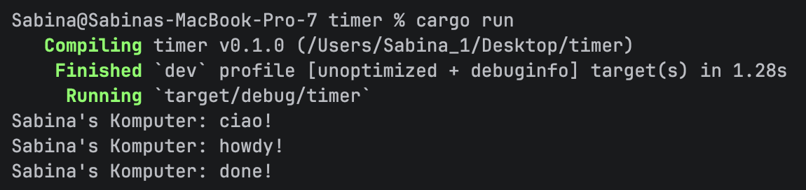

## Module 10 Reflection

#### Experiment 1.2: Understanding how it works

Statement `println!("Sabina's computer: ciao!")` selalu muncul lebih dahulu karena spawn() hanya 
mendaftarkan task asynchronous ke executor dan belum menjalankannya secara langsung.

Task asynchronous baru mulai dijalankan ketika executor.run() dipanggil. Executor kemudian melakukan 
polling terhadap future dan menjalankan task secara bertahap.

Output `Sabina's Komputer: howdy!` muncul ketika task mulai dijalankan oleh executor. Setelah itu, TimerFuture.await 
membuat task menunggu selama beberapa detik tanpa memblokir thread utama. Setelah timer selesai, 
executor melanjutkan task dan mencetak `Sabina's Komputer: done!`.