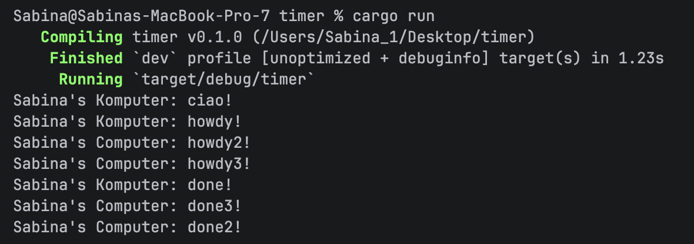
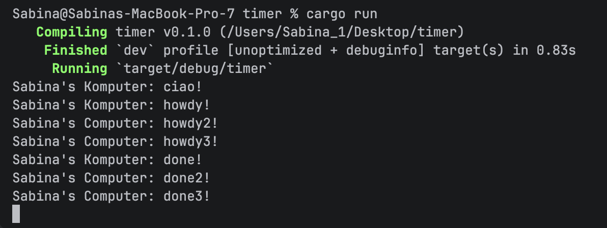

## Module 10 Reflection

#### Experiment 1.2: Understanding How it Works

Statement `println!("Sabina's computer: ciao!")` selalu muncul lebih dahulu karena spawn() hanya 
mendaftarkan task asynchronous ke executor dan belum menjalankannya secara langsung.

Task asynchronous baru mulai dijalankan ketika executor.run() dipanggil. Executor kemudian melakukan 
polling terhadap future dan menjalankan task secara bertahap.

Output `Sabina's Komputer: howdy!` muncul ketika task mulai dijalankan oleh executor. Setelah itu, 
TimerFuture.await membuat task menunggu selama beberapa detik tanpa memblokir thread utama. Setelah 
timer selesai, executor melanjutkan task dan mencetak `Sabina's Komputer: done!`.

 

#### Experiment 1.3: Multiple Spawn and Removing Drop

 

`spawn()` digunakan untuk memasukkan task asynchronous ke dalam queue executor. Spawner bertugas 
sebagai pengirim task ke channel, sedangkan executor bertugas menerima dan menjalankan task 
tersebut hingga selesai.

Executor bekerja dengan melakukan polling terhadap future secara terus menerus sampai future 
menghasilkan `Poll::Ready`.

`drop(spawner)` digunakan untuk menutup channel pengirim task. Jika `drop(spawner)` dihapus, executor 
akan terus menunggu task baru karena channel masih dianggap terbuka. Sehingga, program tidak akan 
selesai atau akan terus berjalan (hang), seperti pada gambar kedua.

Ketika `drop(spawner)` digunakan, executor mengetahui bahwa tidak ada task baru yang akan dikirim 
sehingga program dapat di terminate dengan normal setelah seluruh task selesai dijalankan, seperti
pada gambar pertama.